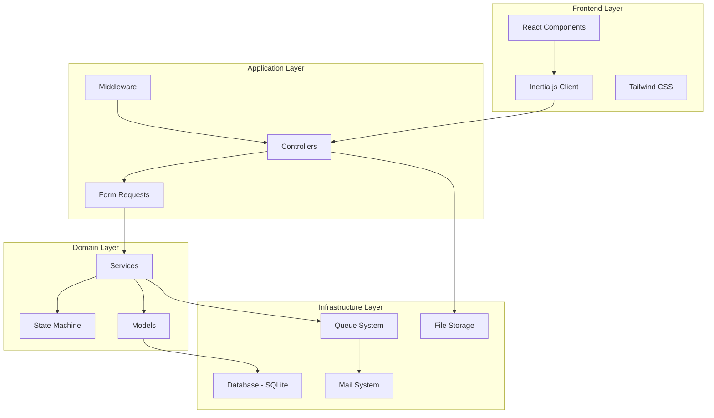
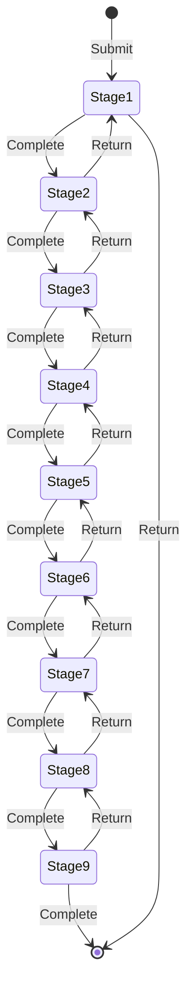

# Design Document: Concept Paper Tracker

## Overview

The Concept Paper Tracker is built on Laravel 12 with Inertia.js and React, leveraging Laravel Breeze for authentication scaffolding. The application follows a traditional MVC architecture on the backend with a component-based React frontend, connected via Inertia.js for seamless SPA-like experience without API complexity.

The system implements a state machine pattern for workflow management, where concept papers transition through predefined stages with role-based authorization at each step. All state changes are logged for audit purposes, and the system uses Laravel's queue system for notifications and deadline monitoring.

## Architecture

### High-Level Architecture



````

### Technology Stack

- **Backend Framework**: Laravel 12
- **Frontend Framework**: React 18
- **Bridge**: Inertia.js 2.0
- **Styling**: Tailwind CSS 3
- **Database**: SQLite (development), MySQL/PostgreSQL (production)
- **Authentication**: Laravel Breeze with Sanctum
- **File Storage**: Laravel Storage (local/S3)
- **Queue System**: Laravel Queue (database driver)
- **Testing**: Pest PHP

### Architectural Patterns

1. **Repository Pattern**: Not used - leveraging Eloquent ORM directly for simplicity
2. **Service Layer**: Business logic encapsulated in service classes
3. **State Machine**: Workflow stage transitions managed by dedicated service
4. **Observer Pattern**: Eloquent observers for audit trail logging
5. **Policy-Based Authorization**: Laravel policies for role-based access control

## Components and Interfaces

### Backend Components

#### 1. Models

**User Model** (extends existing)
```php
class User extends Authenticatable
{
    // Existing fields: id, name, email, password
    // New fields: role, department, is_active

    public function conceptPapers(): HasMany
    public function assignedStages(): HasMany
    public function auditLogs(): HasMany
    public function notifications(): MorphMany
    public function hasRole(string $role): bool
    public function canApproveStage(WorkflowStage $stage): bool
}
````

**ConceptPaper Model**

```php
class ConceptPaper extends Model
{
    // Fields: id, tracking_number, requisitioner_id, department,
    // title, nature_of_request, submitted_at, current_stage_id, status

    public function requisitioner(): BelongsTo
    public function stages(): HasMany
    public function attachments(): HasMany
    public function auditLogs(): HasMany
    public function currentStage(): BelongsTo
    public function isOverdue(): bool
    public function canTransition(string $toStage): bool
}
```

**WorkflowStage Model**

```php
class WorkflowStage extends Model
{
    // Fields: id, concept_paper_id, stage_name, stage_order,
    // assigned_role, assigned_user_id, status, started_at,
    // completed_at, deadline, remarks

    public function conceptPaper(): BelongsTo
    public function assignedUser(): BelongsTo
    public function attachments(): MorphMany
    public function isOverdue(): bool
    public function complete(string $remarks = null): void
    public function return(string $remarks): void
}
```

**Attachment Model**

```php
class Attachment extends Model
{
    // Fields: id, attachable_type, attachable_id, file_name,
    // file_path, file_size, uploaded_by, uploaded_at

    public function attachable(): MorphTo
    public function uploader(): BelongsTo
    public function getUrl(): string
}
```

**AuditLog Model**

```php
class AuditLog extends Model
{
    // Fields: id, concept_paper_id, user_id, action,
    // stage_name, remarks, metadata, created_at

    public function conceptPaper(): BelongsTo
    public function user(): BelongsTo
}
```

**Notification Model** (extends Laravel's built-in)

```php
class DatabaseNotification extends Model
{
    // Uses Laravel's notifications table
    // Custom notification classes for different events
}
```

#### 2. Services

**WorkflowService**

```php
class WorkflowService
{
    public function initializeWorkflow(ConceptPaper $paper): void
    public function advanceToNextStage(WorkflowStage $stage, ?string $remarks): void
    public function returnToPreviousStage(WorkflowStage $stage, string $remarks): void
    public function getNextStageDefinition(int $currentOrder): ?array
    public function calculateDeadline(string $stageName, Carbon $startTime): Carbon
    public function checkOverdueStages(): Collection
}
```

**ConceptPaperService**

```php
class ConceptPaperService
{
    public function create(array $data, User $requisitioner): ConceptPaper
    public function attachFile(ConceptPaper $paper, UploadedFile $file): Attachment
    public function getStatusSummary(ConceptPaper $paper): array
    public function getUserPapers(User $user): Collection
    public function getStatistics(): array
}
```

**NotificationService**

```php
class NotificationService
{
    public function notifyStageAssignment(WorkflowStage $stage): void
    public function notifyOverdue(WorkflowStage $stage): void
    public function notifyCompletion(ConceptPaper $paper): void
    public function notifyReturn(WorkflowStage $stage): void
}
```

**ReportService**

```php
class ReportService
{
    public function generateCsvExport(array $filters = []): string
    public function generatePdfReport(ConceptPaper $paper): string
    public function getProcessingStatistics(): array
    public function getStageAverages(): array
}
```

#### 3. Controllers

**ConceptPaperController**

-   `index()`: List concept papers for current user
-   `create()`: Show submission form
-   `store()`: Create new concept paper
-   `show($id)`: Display concept paper details
-   `update($id)`: Update concept paper (limited fields)
-   `destroy($id)`: Soft delete (admin only)

**WorkflowStageController**

-   `show($id)`: Display stage details
-   `complete($id)`: Mark stage as complete and advance
-   `return($id)`: Return to previous stage
-   `addAttachment($id)`: Upload supporting document

**DashboardController**

-   `index()`: Show role-specific dashboard
-   `statistics()`: Get dashboard statistics

**AdminController**

-   `users()`: Manage users
-   `reports()`: Generate and download reports
-   `settings()`: System configuration

**NotificationController**

-   `index()`: List notifications
-   `markAsRead($id)`: Mark notification as read
-   `markAllAsRead()`: Mark all as read

#### 4. Middleware

**RoleMiddleware**

```php
class RoleMiddleware
{
    // Verify user has required role for route
    public function handle(Request $request, Closure $next, string $role)
}
```

**StageAccessMiddleware**

```php
class StageAccessMiddleware
{
    // Verify user can access/modify specific stage
    public function handle(Request $request, Closure $next)
}
```

#### 5. Policies

**ConceptPaperPolicy**

```php
class ConceptPaperPolicy
{
    public function view(User $user, ConceptPaper $paper): bool
    public function create(User $user): bool
    public function update(User $user, ConceptPaper $paper): bool
    public function delete(User $user, ConceptPaper $paper): bool
}
```

**WorkflowStagePolicy**

```php
class WorkflowStagePolicy
{
    public function complete(User $user, WorkflowStage $stage): bool
    public function return(User $user, WorkflowStage $stage): bool
    public function addAttachment(User $user, WorkflowStage $stage): bool
}
```

### Frontend Components

#### 1. Layout Components

**AuthenticatedLayout**

-   Navigation bar with role-based menu items
-   Notification bell with unread count
-   User dropdown menu
-   Responsive sidebar for mobile

**GuestLayout**

-   Simple layout for login/register pages

#### 2. Page Components

**Dashboard**

-   Role-specific widgets
-   Quick stats cards
-   Recent activity list
-   Overdue items alert

**ConceptPaperList**

-   Filterable/sortable table
-   Status badges
-   Quick actions menu
-   Pagination

**ConceptPaperForm**

-   Multi-step form for submission
-   File upload with drag-and-drop
-   Form validation
-   Department selector

**ConceptPaperDetail**

-   Paper information display
-   Visual workflow timeline
-   Stage cards with status
-   Audit trail accordion
-   Action buttons (context-sensitive)

**StageActionModal**

-   Complete stage form
-   Return stage form
-   Remarks textarea
-   Attachment upload

**AdminUserManagement**

-   User list table
-   Create/edit user modal
-   Role assignment
-   Activate/deactivate toggle

**AdminReports**

-   Filter form
-   Statistics dashboard
-   Export buttons (CSV/PDF)
-   Charts for processing times

#### 3. Shared Components

**StatusBadge**

```jsx
<StatusBadge status="pending|in_progress|completed|returned|overdue" />
```

**WorkflowTimeline**

```jsx
<WorkflowTimeline stages={stages} currentStage={currentStage} />
```

**FileUpload**

```jsx
<FileUpload onUpload={handleUpload} accept=".pdf" maxSize={10} />
```

**NotificationDropdown**

```jsx
<NotificationDropdown notifications={notifications} />
```

**ConfirmationModal**

```jsx
<ConfirmationModal
    isOpen={isOpen}
    onConfirm={handleConfirm}
    onCancel={handleCancel}
    title="Confirm Action"
    message="Are you sure?"
/>
```

**DataTable**

```jsx
<DataTable columns={columns} data={data} sortable filterable pagination />
```

## Data Models

### Database Schema

#### users table

```sql
- id: bigint (PK)
- name: varchar(255)
- email: varchar(255) UNIQUE
- password: varchar(255)
- role: enum('requisitioner', 'sps', 'vp_acad', 'auditor', 'accounting', 'admin')
- department: varchar(255) NULLABLE
- is_active: boolean DEFAULT true
- email_verified_at: timestamp NULLABLE
- remember_token: varchar(100) NULLABLE
- created_at: timestamp
- updated_at: timestamp
```

#### concept_papers table

```sql
- id: bigint (PK)
- tracking_number: varchar(50) UNIQUE
- requisitioner_id: bigint (FK -> users.id)
- department: varchar(255)
- title: text
- nature_of_request: enum('regular', 'urgent', 'emergency')
- submitted_at: timestamp
- current_stage_id: bigint NULLABLE (FK -> workflow_stages.id)
- status: enum('pending', 'in_progress', 'completed', 'returned')
- completed_at: timestamp NULLABLE
- created_at: timestamp
- updated_at: timestamp
- deleted_at: timestamp NULLABLE
```

#### workflow_stages table

```sql
- id: bigint (PK)
- concept_paper_id: bigint (FK -> concept_papers.id)
- stage_name: varchar(100)
- stage_order: tinyint
- assigned_role: varchar(50)
- assigned_user_id: bigint NULLABLE (FK -> users.id)
- status: enum('pending', 'in_progress', 'completed', 'returned')
- started_at: timestamp NULLABLE
- completed_at: timestamp NULLABLE
- deadline: timestamp
- remarks: text NULLABLE
- created_at: timestamp
- updated_at: timestamp
```

#### attachments table

```sql
- id: bigint (PK)
- attachable_type: varchar(255)
- attachable_id: bigint
- file_name: varchar(255)
- file_path: varchar(500)
- file_size: integer
- mime_type: varchar(100)
- uploaded_by: bigint (FK -> users.id)
- created_at: timestamp
- updated_at: timestamp

INDEX: (attachable_type, attachable_id)
```

#### audit_logs table

```sql
- id: bigint (PK)
- concept_paper_id: bigint (FK -> concept_papers.id)
- user_id: bigint (FK -> users.id)
- action: varchar(100)
- stage_name: varchar(100) NULLABLE
- remarks: text NULLABLE
- metadata: json NULLABLE
- created_at: timestamp

INDEX: (concept_paper_id, created_at)
```

#### notifications table (Laravel default)

```sql
- id: uuid (PK)
- type: varchar(255)
- notifiable_type: varchar(255)
- notifiable_id: bigint
- data: json
- read_at: timestamp NULLABLE
- created_at: timestamp
- updated_at: timestamp

INDEX: (notifiable_type, notifiable_id)
```

### Workflow Stage Definitions

```php
const WORKFLOW_STAGES = [
    1 => [
        'name' => 'SPS Review',
        'role' => 'sps',
        'max_days' => 1,
    ],
    2 => [
        'name' => 'VP Acad Review',
        'role' => 'vp_acad',
        'max_days' => 3,
    ],
    3 => [
        'name' => 'Auditing Review',
        'role' => 'auditor',
        'max_days' => 3,
    ],
    4 => [
        'name' => 'Acad Copy Distribution',
        'role' => 'vp_acad',
        'max_days' => 1,
    ],
    5 => [
        'name' => 'Auditing Copy Distribution',
        'role' => 'auditor',
        'max_days' => 1,
    ],
    6 => [
        'name' => 'Voucher Preparation',
        'role' => 'accounting',
        'max_days' => 1,
    ],
    7 => [
        'name' => 'Audit & Countersign',
        'role' => 'auditor',
        'max_days' => 1,
    ],
    8 => [
        'name' => 'Cheque Preparation',
        'role' => 'accounting',
        'max_days' => 4,
    ],
    9 => [
        'name' => 'Budget Release',
        'role' => 'accounting',
        'max_days' => 1,
    ],
];
```

### State Transitions



## Error Handling

### Validation Errors

**Form Request Validation**

-   All user inputs validated using Laravel Form Requests
-   Client-side validation with React Hook Form for immediate feedback
-   Server-side validation as final authority
-   Validation errors returned with 422 status and displayed inline

**File Upload Validation**

-   MIME type checking (PDF only)
-   File size limit (10MB)
-   Virus scanning (optional, via ClamAV)
-   Filename sanitization

### Business Logic Errors

**Workflow Errors**

-   Attempting to complete stage without permission → 403 Forbidden
-   Attempting to skip stages → 400 Bad Request
-   Attempting to modify completed stage → 422 Unprocessable Entity
-   Missing required remarks on return → 422 Unprocessable Entity

**Authorization Errors**

-   Accessing unauthorized resource → 403 Forbidden
-   Invalid authentication → 401 Unauthorized
-   Session expired → Redirect to login

### System Errors

**Database Errors**

-   Connection failures → Retry with exponential backoff
-   Constraint violations → Log and return user-friendly message
-   Transaction failures → Rollback and notify user

**File Storage Errors**

-   Upload failures → Retry once, then notify user
-   Missing files → Log error and show placeholder
-   Storage quota exceeded → Notify admin

**Queue Errors**

-   Failed notification jobs → Retry 3 times with backoff
-   Failed deadline check jobs → Log and alert admin

### Error Logging

-   All errors logged to `storage/logs/laravel.log`
-   Critical errors trigger admin notification
-   User-facing errors show generic message with error ID for support
-   Stack traces only shown in development environment

## Testing Strategy

### Unit Tests

**Model Tests**

-   Relationship integrity
-   Accessor/mutator functionality
-   Business logic methods
-   Scope queries

**Service Tests**

-   Workflow state transitions
-   Deadline calculations
-   Notification triggering
-   Report generation

**Policy Tests**

-   Authorization rules for each role
-   Edge cases (inactive users, deleted records)

### Feature Tests

**Authentication Flow**

-   Login/logout
-   Password reset
-   Session management

**Concept Paper Lifecycle**

-   Submission process
-   Stage progression
-   Return to previous stage
-   Completion

**File Upload**

-   Valid file upload
-   Invalid file rejection
-   File retrieval
-   File deletion

**Notification System**

-   Assignment notifications
-   Overdue notifications
-   Marking as read

**Admin Functions**

-   User management
-   Report generation
-   Statistics calculation

### Integration Tests

**End-to-End Workflow**

-   Complete concept paper from submission to budget release
-   Multiple users interacting with same paper
-   Concurrent stage completions

**Email Notifications**

-   Queue processing
-   Email content verification
-   Delivery confirmation

### Browser Tests (Optional)

**Critical User Flows**

-   Requisitioner submits concept paper
-   Approver completes stage
-   Admin generates report

**Responsive Design**

-   Mobile navigation
-   Form usability on tablets
-   Dashboard layout on different screens

### Test Data

**Seeders**

-   User seeder with all roles
-   Sample concept papers in various stages
-   Historical audit logs for testing reports

**Factories**

-   User factory with role variations
-   ConceptPaper factory with different statuses
-   WorkflowStage factory with overdue scenarios

### Testing Tools

-   **Pest PHP**: Primary testing framework
-   **Laravel Dusk**: Browser testing (optional)
-   **Faker**: Test data generation
-   **Mockery**: Mocking external dependencies

### Coverage Goals

-   Minimum 80% code coverage for services and models
-   100% coverage for critical workflow logic
-   All policies must have corresponding tests
-   All API endpoints must have feature tests

## Performance Considerations

### Database Optimization

-   Indexes on foreign keys and frequently queried columns
-   Eager loading relationships to prevent N+1 queries
-   Database query caching for statistics
-   Pagination for large result sets

### File Storage

-   Store files outside web root
-   Use signed URLs for secure access
-   Implement file size limits
-   Consider S3 for production scalability

### Caching Strategy

-   Cache user permissions for 1 hour
-   Cache workflow stage definitions indefinitely
-   Cache dashboard statistics for 5 minutes
-   Use Redis for production caching

### Queue Optimization

-   Process notifications asynchronously
-   Batch deadline checks (run hourly)
-   Use separate queue for emails
-   Monitor queue depth and processing time

## Security Considerations

### Authentication & Authorization

-   Password hashing with bcrypt
-   CSRF protection on all forms
-   Session-based authentication via Sanctum
-   Role-based access control via policies
-   Middleware protection on all routes

### Input Validation

-   Whitelist allowed file types
-   Sanitize all user inputs
-   Validate file uploads server-side
-   Prevent SQL injection via Eloquent ORM
-   XSS protection via React's default escaping

### Data Protection

-   Encrypt sensitive data at rest (optional)
-   Use HTTPS in production
-   Implement rate limiting on API endpoints
-   Regular security audits
-   Backup strategy for database

### Audit Trail

-   Immutable audit logs
-   Log all state changes
-   Record user actions with timestamps
-   Maintain data integrity with foreign key constraints

## Deployment Considerations

### Environment Configuration

-   Separate .env files for dev/staging/production
-   Queue driver: database (dev), Redis (production)
-   Mail driver: log (dev), SMTP (production)
-   Storage driver: local (dev), S3 (production)

### Migration Strategy

-   Run migrations in order
-   Seed initial workflow stage definitions
-   Create default admin user
-   Set up queue workers

### Monitoring

-   Laravel Telescope for development debugging
-   Application performance monitoring (APM)
-   Error tracking (Sentry/Bugsnag)
-   Queue monitoring dashboard
-   Disk space alerts for file storage

### Backup & Recovery

-   Daily database backups
-   Weekly file storage backups
-   Backup retention policy (30 days)
-   Disaster recovery plan
-   Regular restore testing
