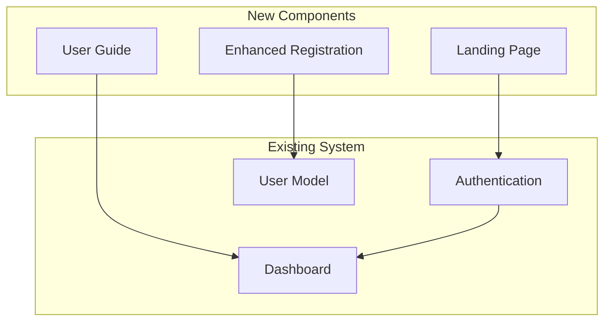

# Design Document: User Enhancements and Guide

## Overview

This design extends the existing Concept Paper Tracker with three major enhancements:

1. **Landing Page**: A public-facing homepage that introduces the system to visitors
2. **Enhanced User Registration**: Additional academic fields (school year, student number) in the registration process
3. **User Guide**: Comprehensive documentation accessible within the application

The design maintains consistency with the existing Laravel + Inertia.js + React architecture and follows the established patterns for authentication, routing, and component structure.

## Architecture

### System Integration

The enhancements integrate with the existing architecture:



### Technology Stack

-   **Backend**: Laravel 12 (existing)
-   **Frontend**: React 18 + Inertia.js (existing)
-   **Styling**: Tailwind CSS 3 (existing)
-   **Database**: SQLite/MySQL (existing)
-   **Markdown Rendering**: react-markdown (new dependency)

## Components and Interfaces

### 1. Landing Page

#### Backend Components

**Route Configuration**

```php
// routes/web.php
Route::get('/', function () {
    return Inertia::render('Landing', [
        'canLogin' => Route::has('login'),
        'canRegister' => Route::has('register'),
    ]);
})->name('landing');
```

**Controller** (optional - can use closure)

```php
class LandingController extends Controller
{
    public function index()
    {
        return Inertia::render('Landing', [
            'canLogin' => Route::has('login'),
            'canRegister' => Route::has('register'),
            'features' => $this->getFeatures(),
            'workflowStages' => config('workflow.stages'),
        ]);
    }

    private function getFeatures(): array
    {
        return [
            [
                'title' => 'Digital Workflow',
                'description' => 'Automated routing through 9-step approval process',
                'icon' => 'workflow',
            ],
            // ... more features
        ];
    }
}
```

#### Frontend Components

**Landing.jsx** (Main Page Component)

```jsx
export default function Landing({
    canLogin,
    canRegister,
    features,
    workflowStages,
}) {
    return (
        <div className="min-h-screen bg-gradient-to-b from-gray-50 to-white">
            <LandingHeader canLogin={canLogin} canRegister={canRegister} />
            <HeroSection />
            <FeaturesSection features={features} />
            <WorkflowSection stages={workflowStages} />
            <RolesSection />
            <UseCasesSection />
            <CTASection />
            <Footer />
        </div>
    );
}
```

**Sub-Components**

```jsx
// LandingHeader.jsx
function LandingHeader({ canLogin, canRegister }) {
    return (
        <header className="fixed top-0 w-full bg-white/90 backdrop-blur-sm shadow-sm z-50">
            <nav className="container mx-auto px-6 py-4 flex justify-between items-center">
                <div className="flex items-center space-x-2">
                    <DocumentIcon className="h-8 w-8 text-indigo-600" />
                    <span className="text-xl font-bold">
                        Concept Paper Tracker
                    </span>
                </div>
                <div className="flex space-x-4">
                    {canLogin && (
                        <Link href={route("login")} className="btn-secondary">
                            Login
                        </Link>
                    )}
                    {canRegister && (
                        <Link href={route("register")} className="btn-primary">
                            Register
                        </Link>
                    )}
                </div>
            </nav>
        </header>
    );
}

// HeroSection.jsx
function HeroSection() {
    return (
        <section className="pt-32 pb-20 px-6">
            <div className="container mx-auto text-center">
                <h1 className="text-5xl font-bold text-gray-900 mb-6">
                    Streamline Your Concept Paper Approvals
                </h1>
                <p className="text-xl text-gray-600 mb-8 max-w-2xl mx-auto">
                    Digital workflow management for concept papers with budget
                    allocation. Track, approve, and manage submissions
                    efficiently.
                </p>
                <div className="flex justify-center space-x-4">
                    <Link href={route("register")} className="btn-primary-lg">
                        Get Started
                    </Link>
                    <a href="#how-it-works" className="btn-secondary-lg">
                        Learn More
                    </a>
                </div>
            </div>
        </section>
    );
}

// FeaturesSection.jsx
function FeaturesSection({ features }) {
    return (
        <section className="py-20 bg-gray-50">
            <div className="container mx-auto px-6">
                <h2 className="text-3xl font-bold text-center mb-12">
                    Key Features
                </h2>
                <div className="grid md:grid-cols-2 lg:grid-cols-4 gap-8">
                    {features.map((feature, index) => (
                        <FeatureCard key={index} {...feature} />
                    ))}
                </div>
            </div>
        </section>
    );
}

// WorkflowSection.jsx
function WorkflowSection({ stages }) {
    return (
        <section id="how-it-works" className="py-20">
            <div className="container mx-auto px-6">
                <h2 className="text-3xl font-bold text-center mb-12">
                    9-Step Approval Process
                </h2>
                <div className="max-w-4xl mx-auto">
                    <WorkflowVisualization stages={stages} />
                </div>
            </div>
        </section>
    );
}

// RolesSection.jsx
function RolesSection() {
    const roles = [
        {
            name: "Requisitioner",
            description: "Submit and track concept papers",
            icon: "user",
        },
        {
            name: "SPS",
            description: "Initial review and approval",
            icon: "shield",
        },
        {
            name: "VP Academic",
            description: "Academic review and distribution",
            icon: "academic",
        },
        {
            name: "Auditor",
            description: "Audit review and countersigning",
            icon: "check",
        },
        {
            name: "Accounting",
            description: "Voucher and cheque preparation",
            icon: "calculator",
        },
        {
            name: "Admin",
            description: "System management and reporting",
            icon: "settings",
        },
    ];

    return (
        <section className="py-20 bg-gray-50">
            <div className="container mx-auto px-6">
                <h2 className="text-3xl font-bold text-center mb-12">
                    User Roles
                </h2>
                <div className="grid md:grid-cols-2 lg:grid-cols-3 gap-6">
                    {roles.map((role, index) => (
                        <RoleCard key={index} {...role} />
                    ))}
                </div>
            </div>
        </section>
    );
}
```

### 2. Enhanced User Registration

#### Database Schema Changes

**Migration: Add Academic Fields to Users Table**

```php
// database/migrations/2025_11_13_000000_add_academic_fields_to_users_table.php
public function up(): void
{
    Schema::table('users', function (Blueprint $table) {
        $table->string('school_year')->nullable()->after('department');
        $table->string('student_number')->nullable()->after('school_year');
    });
}
```

#### Backend Components

**Updated User Model**

```php
class User extends Authenticatable
{
    protected $fillable = [
        'name',
        'email',
        'password',
        'role',
        'department',
        'school_year',
        'student_number',
        'is_active',
    ];

    protected $casts = [
        'email_verified_at' => 'datetime',
        'password' => 'hashed',
        'is_active' => 'boolean',
    ];

    // Accessor for formatted school year display
    public function getFormattedSchoolYearAttribute(): ?string
    {
        return $this->school_year;
    }

    // Check if user is a student (has student number)
    public function isStudent(): bool
    {
        return !empty($this->student_number);
    }
}
```

**Form Request Validation**

```php
// app/Http/Requests/Auth/RegisterRequest.php
class RegisterRequest extends FormRequest
{
    public function rules(): array
    {
        return [
            'name' => ['required', 'string', 'max:255'],
            'email' => ['required', 'string', 'email', 'max:255', 'unique:users'],
            'password' => ['required', 'confirmed', Rules\Password::defaults()],
            'role' => ['required', 'in:requisitioner,sps,vp_acad,auditor,accounting'],
            'department' => ['required', 'string', 'max:255'],
            'school_year' => ['nullable', 'string', 'max:50'],
            'student_number' => ['nullable', 'string', 'max:50', 'unique:users'],
        ];
    }

    public function messages(): array
    {
        return [
            'school_year.max' => 'School year must not exceed 50 characters.',
            'student_number.unique' => 'This student number is already registered.',
        ];
    }
}
```

**Updated RegisteredUserController**

```php
public function store(RegisterRequest $request): RedirectResponse
{
    $user = User::create([
        'name' => $request->name,
        'email' => $request->email,
        'password' => Hash::make($request->password),
        'role' => $request->role,
        'department' => $request->department,
        'school_year' => $request->school_year,
        'student_number' => $request->student_number,
    ]);

    event(new Registered($user));

    Auth::login($user);

    return redirect(route('dashboard', absolute: false));
}
```

#### Frontend Components

**Enhanced Register.jsx**

```jsx
export default function Register() {
    const { data, setData, post, processing, errors, reset } = useForm({
        name: "",
        email: "",
        password: "",
        password_confirmation: "",
        role: "requisitioner",
        department: "",
        school_year: "",
        student_number: "",
    });

    const roleDescriptions = {
        requisitioner: "Submit and track concept papers",
        sps: "School Principal/Supervisor - Initial review",
        vp_acad: "VP Academic Affairs - Academic review",
        auditor: "Audit review and countersigning",
        accounting: "Voucher and cheque preparation",
    };

    const submit = (e) => {
        e.preventDefault();
        post(route("register"), {
            onFinish: () => reset("password", "password_confirmation"),
        });
    };

    return (
        <GuestLayout>
            <Head title="Register" />

            <form onSubmit={submit} className="space-y-6">
                {/* Name Field */}
                <div>
                    <InputLabel htmlFor="name" value="Full Name" />
                    <TextInput
                        id="name"
                        name="name"
                        value={data.name}
                        className="mt-1 block w-full"
                        onChange={(e) => setData("name", e.target.value)}
                        required
                    />
                    <InputError message={errors.name} className="mt-2" />
                </div>

                {/* Email Field */}
                <div>
                    <InputLabel htmlFor="email" value="Email" />
                    <TextInput
                        id="email"
                        type="email"
                        name="email"
                        value={data.email}
                        className="mt-1 block w-full"
                        onChange={(e) => setData("email", e.target.value)}
                        required
                    />
                    <InputError message={errors.email} className="mt-2" />
                </div>

                {/* Role Selection */}
                <div>
                    <InputLabel htmlFor="role" value="Role" />
                    <select
                        id="role"
                        name="role"
                        value={data.role}
                        onChange={(e) => setData("role", e.target.value)}
                        className="mt-1 block w-full border-gray-300 rounded-md shadow-sm"
                        required
                    >
                        {Object.entries(roleDescriptions).map(
                            ([value, description]) => (
                                <option key={value} value={value}>
                                    {value.replace("_", " ").toUpperCase()} -{" "}
                                    {description}
                                </option>
                            )
                        )}
                    </select>
                    <p className="mt-1 text-sm text-gray-600">
                        {roleDescriptions[data.role]}
                    </p>
                    <InputError message={errors.role} className="mt-2" />
                </div>

                {/* Department Field */}
                <div>
                    <InputLabel htmlFor="department" value="Department" />
                    <TextInput
                        id="department"
                        name="department"
                        value={data.department}
                        className="mt-1 block w-full"
                        onChange={(e) => setData("department", e.target.value)}
                        required
                    />
                    <InputError message={errors.department} className="mt-2" />
                </div>

                {/* School Year Field */}
                <div>
                    <InputLabel
                        htmlFor="school_year"
                        value="School Year (Optional)"
                    />
                    <TextInput
                        id="school_year"
                        name="school_year"
                        value={data.school_year}
                        className="mt-1 block w-full"
                        placeholder="e.g., 2024-2025 or 1st Year"
                        onChange={(e) => setData("school_year", e.target.value)}
                    />
                    <p className="mt-1 text-sm text-gray-600">
                        Enter your current academic year
                    </p>
                    <InputError message={errors.school_year} className="mt-2" />
                </div>

                {/* Student Number Field (conditional) */}
                {data.role === "requisitioner" && (
                    <div>
                        <InputLabel
                            htmlFor="student_number"
                            value="Student Number (Optional)"
                        />
                        <TextInput
                            id="student_number"
                            name="student_number"
                            value={data.student_number}
                            className="mt-1 block w-full"
                            placeholder="e.g., 2024-00001"
                            onChange={(e) =>
                                setData("student_number", e.target.value)
                            }
                        />
                        <p className="mt-1 text-sm text-gray-600">
                            Your unique student identification number
                        </p>
                        <InputError
                            message={errors.student_number}
                            className="mt-2"
                        />
                    </div>
                )}

                {/* Password Fields */}
                <div>
                    <InputLabel htmlFor="password" value="Password" />
                    <TextInput
                        id="password"
                        type="password"
                        name="password"
                        value={data.password}
                        className="mt-1 block w-full"
                        onChange={(e) => setData("password", e.target.value)}
                        required
                    />
                    <InputError message={errors.password} className="mt-2" />
                </div>

                <div>
                    <InputLabel
                        htmlFor="password_confirmation"
                        value="Confirm Password"
                    />
                    <TextInput
                        id="password_confirmation"
                        type="password"
                        name="password_confirmation"
                        value={data.password_confirmation}
                        className="mt-1 block w-full"
                        onChange={(e) =>
                            setData("password_confirmation", e.target.value)
                        }
                        required
                    />
                    <InputError
                        message={errors.password_confirmation}
                        className="mt-2"
                    />
                </div>

                <div className="flex items-center justify-end">
                    <Link
                        href={route("login")}
                        className="text-sm text-gray-600 underline hover:text-gray-900"
                    >
                        Already registered?
                    </Link>

                    <PrimaryButton className="ms-4" disabled={processing}>
                        Register
                    </PrimaryButton>
                </div>
            </form>
        </GuestLayout>
    );
}
```

**Enhanced Login.jsx**

```jsx
export default function Login({ status, canResetPassword }) {
    // ... existing code ...

    return (
        <GuestLayout>
            <Head title="Log in" />

            {/* Add helpful information section */}
            <div className="mb-6 p-4 bg-blue-50 rounded-lg">
                <h3 className="text-sm font-semibold text-blue-900 mb-2">
                    Need Help?
                </h3>
                <ul className="text-sm text-blue-800 space-y-1">
                    <li>• Use your registered email and password</li>
                    <li>
                        •{" "}
                        <Link href={route("user-guide")} className="underline">
                            View User Guide
                        </Link>
                    </li>
                    <li>• Contact support: support@example.com</li>
                </ul>
            </div>

            {/* Existing form */}
            <form onSubmit={submit}>{/* ... existing fields ... */}</form>
        </GuestLayout>
    );
}
```

### 3. User Guide System

#### Backend Components

**Route Configuration**

```php
// routes/web.php
Route::middleware('auth')->group(function () {
    Route::get('/user-guide', [UserGuideController::class, 'index'])->name('user-guide');
    Route::get('/user-guide/{section}', [UserGuideController::class, 'show'])->name('user-guide.section');
});
```

**UserGuideController**

```php
namespace App\Http\Controllers;

use Illuminate\Http\Request;
use Inertia\Inertia;
use Inertia\Response;

class UserGuideController extends Controller
{
    public function index(): Response
    {
        return Inertia::render('UserGuide/Index', [
            'sections' => $this->getSections(),
            'tableOfContents' => $this->getTableOfContents(),
        ]);
    }

    public function show(string $section): Response
    {
        $content = $this->getGuideContent($section);

        if (!$content) {
            abort(404);
        }

        return Inertia::render('UserGuide/Section', [
            'section' => $section,
            'content' => $content,
            'navigation' => $this->getNavigation($section),
        ]);
    }

    private function getSections(): array
    {
        return [
            'getting-started' => [
                'title' => 'Getting Started',
                'icon' => 'play',
                'subsections' => [
                    'overview' => 'System Overview',
                    'login' => 'Logging In',
                    'navigation' => 'Navigating the System',
                ],
            ],
            'requisitioner' => [
                'title' => 'Requisitioner Guide',
                'icon' => 'document',
                'subsections' => [
                    'submit' => 'Submitting Concept Papers',
                    'track' => 'Tracking Submissions',
                    'attachments' => 'Managing Attachments',
                ],
            ],
            'approver' => [
                'title' => 'Approver Guide',
                'icon' => 'check-circle',
                'subsections' => [
                    'review' => 'Reviewing Papers',
                    'complete' => 'Completing Stages',
                    'return' => 'Returning Papers',
                    'deadlines' => 'Managing Deadlines',
                ],
            ],
            'admin' => [
                'title' => 'Administrator Guide',
                'icon' => 'cog',
                'subsections' => [
                    'access' => 'Accessing Admin Dashboard',
                    'users' => 'Managing Users',
                    'reports' => 'Generating Reports',
                    'troubleshooting' => 'Troubleshooting',
                ],
            ],
            'workflow' => [
                'title' => 'Workflow Process',
                'icon' => 'flow',
                'subsections' => [
                    'stages' => 'Understanding Stages',
                    'roles' => 'Role Responsibilities',
                    'timeline' => 'Processing Timeline',
                ],
            ],
            'faq' => [
                'title' => 'FAQ',
                'icon' => 'question',
                'subsections' => [
                    'account' => 'Account Questions',
                    'files' => 'File Upload Questions',
                    'notifications' => 'Notification Questions',
                    'support' => 'Getting Support',
                ],
            ],
        ];
    }

    private function getGuideContent(string $section): ?array
    {
        // Load markdown content from storage or database
        $filePath = resource_path("docs/user-guide/{$section}.md");

        if (!file_exists($filePath)) {
            return null;
        }

        return [
            'markdown' => file_get_contents($filePath),
            'title' => $this->getSectionTitle($section),
            'lastUpdated' => date('F j, Y', filemtime($filePath)),
        ];
    }

    private function getTableOfContents(): array
    {
        $sections = $this->getSections();
        $toc = [];

        foreach ($sections as $key => $section) {
            $toc[] = [
                'id' => $key,
                'title' => $section['title'],
                'icon' => $section['icon'],
                'subsections' => $section['subsections'],
            ];
        }

        return $toc;
    }

    private function getNavigation(string $currentSection): array
    {
        $sections = array_keys($this->getSections());
        $currentIndex = array_search($currentSection, $sections);

        return [
            'previous' => $currentIndex > 0 ? $sections[$currentIndex - 1] : null,
            'next' => $currentIndex < count($sections) - 1 ? $sections[$currentIndex + 1] : null,
        ];
    }

    private function getSectionTitle(string $section): string
    {
        $sections = $this->getSections();
        return $sections[$section]['title'] ?? 'User Guide';
    }
}
```

#### Frontend Components

**UserGuide/Index.jsx**

```jsx
import { Head, Link } from "@inertiajs/react";
import AuthenticatedLayout from "@/Layouts/AuthenticatedLayout";
import {
    PlayIcon,
    DocumentTextIcon,
    CheckCircleIcon,
    CogIcon,
    ArrowPathIcon,
    QuestionMarkCircleIcon,
} from "@heroicons/react/24/outline";

const iconMap = {
    play: PlayIcon,
    document: DocumentTextIcon,
    "check-circle": CheckCircleIcon,
    cog: CogIcon,
    flow: ArrowPathIcon,
    question: QuestionMarkCircleIcon,
};

export default function UserGuideIndex({ sections, tableOfContents }) {
    return (
        <AuthenticatedLayout
            header={
                <h2 className="text-xl font-semibold leading-tight text-gray-800">
                    User Guide
                </h2>
            }
        >
            <Head title="User Guide" />

            <div className="py-12">
                <div className="mx-auto max-w-7xl sm:px-6 lg:px-8">
                    {/* Introduction */}
                    <div className="mb-8 overflow-hidden bg-white shadow-sm sm:rounded-lg">
                        <div className="p-6 text-gray-900">
                            <h1 className="text-3xl font-bold mb-4">
                                Concept Paper Tracker User Guide
                            </h1>
                            <p className="text-lg text-gray-600 mb-4">
                                Welcome to the comprehensive user guide for the
                                Concept Paper Tracker system. This guide will
                                help you understand how to use the system
                                effectively based on your role.
                            </p>
                            <p className="text-gray-600">
                                Select a section below to get started, or use
                                the search function to find specific topics.
                            </p>
                        </div>
                    </div>

                    {/* Table of Contents */}
                    <div className="grid gap-6 md:grid-cols-2 lg:grid-cols-3">
                        {tableOfContents.map((section) => {
                            const Icon = iconMap[section.icon];
                            return (
                                <Link
                                    key={section.id}
                                    href={route(
                                        "user-guide.section",
                                        section.id
                                    )}
                                    className="block p-6 bg-white rounded-lg shadow-sm hover:shadow-md transition-shadow"
                                >
                                    <div className="flex items-center mb-4">
                                        <div className="p-2 bg-indigo-100 rounded-lg">
                                            <Icon className="h-6 w-6 text-indigo-600" />
                                        </div>
                                        <h3 className="ml-3 text-lg font-semibold text-gray-900">
                                            {section.title}
                                        </h3>
                                    </div>
                                    <ul className="space-y-2">
                                        {Object.entries(
                                            section.subsections
                                        ).map(([key, title]) => (
                                            <li
                                                key={key}
                                                className="text-sm text-gray-600"
                                            >
                                                • {title}
                                            </li>
                                        ))}
                                    </ul>
                                </Link>
                            );
                        })}
                    </div>

                    {/* Quick Links */}
                    <div className="mt-8 p-6 bg-blue-50 rounded-lg">
                        <h3 className="text-lg font-semibold text-blue-900 mb-4">
                            Quick Links
                        </h3>
                        <div className="grid md:grid-cols-3 gap-4">
                            <Link
                                href={route(
                                    "user-guide.section",
                                    "getting-started"
                                )}
                                className="text-blue-700 hover:text-blue-900 underline"
                            >
                                → Getting Started Guide
                            </Link>
                            <Link
                                href={route("user-guide.section", "workflow")}
                                className="text-blue-700 hover:text-blue-900 underline"
                            >
                                → Workflow Process
                            </Link>
                            <Link
                                href={route("user-guide.section", "faq")}
                                className="text-blue-700 hover:text-blue-900 underline"
                            >
                                → Frequently Asked Questions
                            </Link>
                        </div>
                    </div>
                </div>
            </div>
        </AuthenticatedLayout>
    );
}
```

**UserGuide/Section.jsx**

```jsx
import { Head, Link } from "@inertiajs/react";
import AuthenticatedLayout from "@/Layouts/AuthenticatedLayout";
import ReactMarkdown from "react-markdown";
import { ChevronLeftIcon, ChevronRightIcon } from "@heroicons/react/24/outline";

export default function UserGuideSection({ section, content, navigation }) {
    return (
        <AuthenticatedLayout
            header={
                <div className="flex items-center justify-between">
                    <h2 className="text-xl font-semibold leading-tight text-gray-800">
                        {content.title}
                    </h2>
                    <Link
                        href={route("user-guide")}
                        className="text-sm text-gray-600 hover:text-gray-900"
                    >
                        ← Back to Guide
                    </Link>
                </div>
            }
        >
            <Head title={`User Guide - ${content.title}`} />

            <div className="py-12">
                <div className="mx-auto max-w-4xl sm:px-6 lg:px-8">
                    <div className="overflow-hidden bg-white shadow-sm sm:rounded-lg">
                        <div className="p-8">
                            {/* Content */}
                            <article className="prose prose-indigo max-w-none">
                                <ReactMarkdown>
                                    {content.markdown}
                                </ReactMarkdown>
                            </article>

                            {/* Last Updated */}
                            <div className="mt-8 pt-6 border-t border-gray-200">
                                <p className="text-sm text-gray-500">
                                    Last updated: {content.lastUpdated}
                                </p>
                            </div>

                            {/* Navigation */}
                            <div className="mt-8 flex justify-between">
                                {navigation.previous ? (
                                    <Link
                                        href={route(
                                            "user-guide.section",
                                            navigation.previous
                                        )}
                                        className="flex items-center text-indigo-600 hover:text-indigo-800"
                                    >
                                        <ChevronLeftIcon className="h-5 w-5 mr-1" />
                                        Previous
                                    </Link>
                                ) : (
                                    <div />
                                )}

                                {navigation.next ? (
                                    <Link
                                        href={route(
                                            "user-guide.section",
                                            navigation.next
                                        )}
                                        className="flex items-center text-indigo-600 hover:text-indigo-800"
                                    >
                                        Next
                                        <ChevronRightIcon className="h-5 w-5 ml-1" />
                                    </Link>
                                ) : (
                                    <div />
                                )}
                            </div>
                        </div>
                    </div>
                </div>
            </div>
        </AuthenticatedLayout>
    );
}
```

#### Documentation Content Structure

**Markdown Files Location**: `resources/docs/user-guide/`

**Example: getting-started.md**

```markdown
# Getting Started

## System Overview

The Concept Paper Tracker is a digital workflow management system designed to streamline the approval process for concept papers with budget allocation. The system replaces manual paper-based routing with an automated 9-step approval workflow.

### Key Benefits

-   **Transparency**: Track your submission status in real-time
-   **Efficiency**: Automated routing reduces processing time
-   **Accountability**: Complete audit trail of all actions
-   **Notifications**: Stay informed about pending tasks and deadlines

## Logging In

1. Navigate to the login page
2. Enter your registered email address
3. Enter your password
4. Click "Log in"

### First Time Login

If this is your first time logging in:

-   You will be directed to your dashboard
-   Take a moment to familiarize yourself with the navigation
-   Check your profile to ensure your information is correct

### Forgot Password

If you've forgotten your password:

1. Click "Forgot your password?" on the login page
2. Enter your email address
3. Check your email for a password reset link
4. Follow the instructions to create a new password

## Navigating the System

### Main Navigation

The main navigation menu provides access to key features:

-   **Dashboard**: Your personalized overview
-   **Submit Paper** (Requisitioners): Create new submissions
-   **My Papers** (Requisitioners): View your submissions
-   **Pending Approvals** (Approvers): Papers awaiting your action
-   **All Papers** (Admin): System-wide view
-   **User Management** (Admin): Manage user accounts
-   **Reports** (Admin): Generate reports and statistics
-   **User Guide**: This documentation

### Notifications

The notification bell in the top right shows:

-   New assignments
-   Overdue tasks
-   Status updates
-   System announcements

Click the bell to view recent notifications or mark them as read.

### Profile Menu

Access your profile menu in the top right to:

-   View/edit your profile
-   Change your password
-   Log out
```

**Example: requisitioner.md**

```markdown
# Requisitioner Guide

## Submitting Concept Papers

### Step 1: Access the Submission Form

1. Click "Submit Paper" in the main navigation
2. You will see the concept paper submission form

### Step 2: Fill in Required Information

Complete all required fields:

-   **Requisitioner Name**: Your full name (auto-filled)
-   **Department**: Your department
-   **Concept Paper Title**: A clear, descriptive title
-   **Nature of Request**: Select Regular, Urgent, or Emergency

### Step 3: Upload Documents

1. Click "Choose File" or drag and drop your PDF
2. Ensure your file is:
    - In PDF format
    - Under 10MB in size
    - Clearly labeled

### Step 4: Review and Submit

1. Review all information for accuracy
2. Click "Submit Concept Paper"
3. You will receive a tracking number
4. A notification will be sent to the first approver

## Tracking Submissions

### Viewing Your Papers

1. Navigate to "My Papers"
2. You will see a list of all your submissions
3. Each paper shows:
    - Tracking number
    - Title
    - Current stage
    - Status (Pending, In Progress, Completed, Returned)
    - Submission date

### Understanding Status Indicators

-   **Yellow badge**: Pending or in progress
-   **Green badge**: Completed
-   **Red badge**: Overdue or returned

### Viewing Paper Details

Click on any paper to view:

-   Complete information
-   Visual workflow timeline
-   Current stage and assigned approver
-   Audit trail of all actions
-   All attachments

## Managing Attachments

### Viewing Attachments

1. Open the concept paper details
2. Scroll to the "Attachments" section
3. Click any attachment to download

### Understanding Attachment Types

-   **Initial Submission**: Your original uploaded document
-   **Supporting Documents**: Added by approvers during review
```

**Example: admin.md**

```markdown
# Administrator Guide

## Accessing the Admin Dashboard

### Admin Access Requirements

To access admin features, you must:

-   Have the "admin" role assigned to your account
-   Be logged into the system
-   Have an active account status

### Navigating to Admin Features

1. Log in with your admin credentials
2. Look for admin-specific menu items:
    - "User Management"
    - "Reports"
    - "All Papers"

## Managing Users

### Viewing All Users

1. Click "User Management" in the navigation
2. You will see a table of all users with:
    - Name
    - Email
    - Role
    - Department
    - School Year
    - Student Number (if applicable)
    - Status (Active/Inactive)

### Creating New Users

1. Click "Create User" button
2. Fill in the user information:
    - Full Name
    - Email Address
    - Role (select from dropdown)
    - Department
    - School Year (optional)
    - Student Number (optional for students)
    - Initial Password
3. Click "Create User"
4. The user will receive an email with login instructions

### Editing User Information

1. Find the user in the list
2. Click the "Edit" button
3. Modify any field:
    - Name
    - Email
    - Role
    - Department
    - School Year
    - Student Number
4. Click "Save Changes"

### Assigning Roles

Available roles:

-   **Requisitioner**: Can submit and track papers
-   **SPS**: School Principal/Supervisor approval
-   **VP Acad**: Vice President Academic Affairs approval
-   **Auditor**: Audit review and countersigning
-   **Accounting**: Voucher and cheque preparation
-   **Admin**: Full system access

To change a user's role:

1. Edit the user
2. Select new role from dropdown
3. Save changes
4. User's access will update immediately

### Activating/Deactivating Users

To deactivate a user:

1. Find the user in the list
2. Toggle the "Active" switch to OFF
3. User will no longer be able to log in
4. Existing assignments remain intact

To reactivate:

1. Toggle the "Active" switch to ON
2. User can log in again

### Filtering Users

Use the filter options to find users:

-   Filter by role
-   Filter by department
-   Filter by school year
-   Search by name or email

## Generating Reports

### Accessing Reports

1. Click "Reports" in the navigation
2. You will see the reports dashboard

### Available Reports

#### CSV Export

-   Exports all concept paper data
-   Includes all fields and timestamps
-   Useful for external analysis

To generate:

1. Select date range (optional)
2. Select status filter (optional)
3. Click "Export CSV"
4. File will download automatically

#### PDF Report

-   Generates detailed report for a single paper
-   Includes complete audit trail
-   Suitable for printing/archiving

To generate:

1. Navigate to a concept paper
2. Click "Generate PDF Report"
3. PDF will download automatically

### Viewing Statistics

The reports dashboard shows:

-   Total papers by status
-   Average processing time per stage
-   Overdue papers count
-   Papers completed this month
-   Processing time trends

### Understanding Metrics

**Average Processing Time**:

-   Shows how long each stage typically takes
-   Helps identify bottlenecks
-   Measured in business days

**Completion Rate**:

-   Percentage of papers completed vs. submitted
-   Tracked monthly and yearly

**Overdue Analysis**:

-   Which stages have most overdue items
-   Which users have pending overdue tasks

## Troubleshooting

### Common Issues

#### User Cannot Log In

Possible causes:

1. Account is inactive
    - Solution: Activate the account
2. Incorrect password
    - Solution: Reset password for user
3. Email not verified
    - Solution: Manually verify email in user management

#### Paper Stuck in Stage

Possible causes:

1. Assigned user is inactive
    - Solution: Reassign to active user
2. System error
    - Solution: Check logs, contact technical support

#### Notifications Not Sending

Possible causes:

1. Email configuration issue
    - Solution: Check .env mail settings
2. Queue not processing
    - Solution: Restart queue worker

### Getting Technical Support

For technical issues:

-   Email: support@example.com
-   Include: Error message, user account, timestamp
-   Attach: Screenshots if applicable

### System Maintenance

Regular maintenance tasks:

-   Review inactive users monthly
-   Archive completed papers quarterly
-   Check storage space weekly
-   Review audit logs for anomalies
```

**Example: workflow.md**

```markdown
# Workflow Process

## Understanding the 9-Step Process

The concept paper approval workflow consists of 9 sequential stages. Each stage must be completed before the next can begin.

### Complete Workflow Diagram
```

1. SPS Review (1 day)
   ↓
2. VP Acad Review (3 days)
   ↓
3. Auditing Review (3 days)
   ↓
4. Acad Copy Distribution (1 day)
   ↓
5. Auditing Copy Distribution (1 day)
   ↓
6. Voucher Preparation (1 day)
   ↓
7. Audit & Countersign (1 day)
   ↓
8. Cheque Preparation (4 days)
   ↓
9. Budget Release (1 day)

```

## Stage Details

### Stage 1: SPS Review
- **Assigned to**: School Principal/Supervisor
- **Maximum time**: 1 business day
- **Purpose**: Initial review and approval
- **Actions**: Review, approve, or return with remarks

### Stage 2: VP Acad Review
- **Assigned to**: Vice President Academic Affairs
- **Maximum time**: 3 business days
- **Purpose**: Academic review and approval
- **Actions**: Review, approve, or return with remarks

### Stage 3: Auditing Review
- **Assigned to**: Auditor
- **Maximum time**: 3 business days
- **Purpose**: Initial audit review
- **Actions**: Review, approve, or return with remarks

### Stage 4: Acad Copy Distribution
- **Assigned to**: Vice President Academic Affairs
- **Maximum time**: 1 business day
- **Purpose**: Distribute academic copy
- **Actions**: Confirm distribution

### Stage 5: Auditing Copy Distribution
- **Assigned to**: Auditor
- **Maximum time**: 1 business day
- **Purpose**: Distribute auditing copy
- **Actions**: Confirm distribution

### Stage 6: Voucher Preparation
- **Assigned to**: Accounting
- **Maximum time**: 1 business day
- **Purpose**: Prepare payment voucher
- **Actions**: Create voucher, attach documentation

### Stage 7: Audit & Countersign
- **Assigned to**: Auditor
- **Maximum time**: 1 business day
- **Purpose**: Final audit and countersigning
- **Actions**: Review voucher, countersign

### Stage 8: Cheque Preparation
- **Assigned to**: Accounting
- **Maximum time**: 4 business days
- **Purpose**: Prepare payment cheque
- **Actions**: Process payment, prepare cheque

### Stage 9: Budget Release
- **Assigned to**: Accounting
- **Maximum time**: 1 business day
- **Purpose**: Release budget and complete process
- **Actions**: Finalize payment, mark complete

## Role Responsibilities

### Requisitioner
- Submit concept papers with complete information
- Track submission status
- Respond to requests for additional information
- Resubmit if returned

### SPS (School Principal/Supervisor)
- Review submissions within 1 day
- Verify completeness and appropriateness
- Approve or return with specific feedback

### VP Academic Affairs
- Conduct academic review within 3 days
- Distribute academic copies within 1 day
- Ensure academic standards are met

### Auditor
- Perform audit reviews within 3 days
- Distribute auditing copies within 1 day
- Countersign vouchers within 1 day
- Ensure compliance with policies

### Accounting
- Prepare vouchers within 1 day
- Prepare cheques within 4 days
- Release budget within 1 day
- Maintain financial records

### Administrator
- Manage user accounts
- Generate reports
- Monitor system performance
- Provide support

## Processing Timeline

### Total Processing Time

Under normal circumstances:
- **Minimum**: 16 business days (if all stages completed on time)
- **Average**: 20-25 business days
- **Maximum**: Varies based on returns and delays

### Factors Affecting Timeline

1. **Nature of Request**
   - Regular: Standard timeline
   - Urgent: Priority processing
   - Emergency: Expedited review

2. **Completeness**
   - Complete submissions process faster
   - Missing information causes delays

3. **Approver Availability**
   - Active approvers process quickly
   - Inactive/unavailable approvers cause delays

4. **Returns**
   - Each return adds processing time
   - Multiple returns significantly extend timeline

## What Triggers Stage Transitions

### Automatic Advancement

A stage automatically advances to the next when:
1. Assigned user completes the stage
2. Required remarks are provided (if applicable)
3. All attachments are uploaded (if required)

### Manual Return

A stage can be returned to the previous stage when:
1. Assigned user identifies issues
2. Remarks explaining the return are required
3. Requisitioner must address issues and resubmit

### Overdue Handling

When a stage becomes overdue:
1. System marks stage as overdue (red indicator)
2. Notification sent to assigned user
3. Notification sent to admin
4. Stage remains assigned until completed

## Best Practices

### For Requisitioners
- Submit complete, accurate information
- Upload clear, properly formatted documents
- Respond promptly to return requests
- Track your submissions regularly

### For Approvers
- Review assignments daily
- Complete stages before deadline
- Provide clear, specific remarks
- Upload supporting documents when needed

### For Administrators
- Monitor overdue stages
- Address bottlenecks promptly
- Ensure users are properly trained
- Generate regular reports for analysis
```

## Data Models

### Updated User Model Schema

```sql
users table:
- id: bigint (PK)
- name: varchar(255)
- email: varchar(255) UNIQUE
- password: varchar(255)
- role: enum('requisitioner', 'sps', 'vp_acad', 'auditor', 'accounting', 'admin')
- department: varchar(255) NULLABLE
- school_year: varchar(50) NULLABLE          -- NEW FIELD
- student_number: varchar(50) NULLABLE UNIQUE -- NEW FIELD
- is_active: boolean DEFAULT true
- email_verified_at: timestamp NULLABLE
- remember_token: varchar(100) NULLABLE
- created_at: timestamp
- updated_at: timestamp
```

### Profile Display Data

```php
// Profile data structure
[
    'user' => [
        'id' => 1,
        'name' => 'John Doe',
        'email' => 'john@example.com',
        'role' => 'requisitioner',
        'department' => 'Computer Science',
        'school_year' => '2024-2025',
        'student_number' => '2024-00001',
        'is_active' => true,
    ]
]
```

## Error Handling

### Validation Errors

**Registration Form Validation**

-   School year format validation (optional but must be valid if provided)
-   Student number uniqueness check
-   Department required for all roles
-   Role must be valid enum value

**Profile Update Validation**

-   Cannot change email to existing email
-   Student number must remain unique
-   School year format validation

### User Guide Errors

**404 - Section Not Found**

-   Display friendly error message
-   Provide link back to guide index
-   Suggest similar sections

**File Loading Errors**

-   Gracefully handle missing markdown files
-   Display error message to admin
-   Log error for debugging

### Landing Page Errors

**Route Conflicts**

-   Ensure landing page doesn't conflict with existing routes
-   Redirect authenticated users to dashboard
-   Handle missing route definitions gracefully

## Testing Strategy

### Unit Tests

**User Model Tests**

-   Test school_year and student_number accessors
-   Test isStudent() method
-   Test validation rules
-   Test uniqueness constraints

**UserGuideController Tests**

-   Test section retrieval
-   Test navigation generation
-   Test table of contents generation
-   Test 404 handling for invalid sections

### Feature Tests

**Landing Page Tests**

-   Test unauthenticated access
-   Test authenticated user redirect
-   Test navigation links
-   Test responsive layout

**Registration Tests**

-   Test registration with school year
-   Test registration with student number
-   Test registration without optional fields
-   Test student number uniqueness
-   Test validation errors

**User Guide Tests**

-   Test guide index access
-   Test section access
-   Test navigation between sections
-   Test markdown rendering
-   Test authentication requirement

**Profile Tests**

-   Test profile display with new fields
-   Test profile update with school year
-   Test profile update with student number
-   Test validation on updates

### Integration Tests

**Complete User Journey**

1. Visit landing page
2. Register with academic information
3. Log in
4. View user guide
5. Navigate through guide sections
6. Update profile information

### Browser Tests (Optional)

**Landing Page**

-   Test responsive design
-   Test navigation clicks
-   Test scroll behavior
-   Test CTA buttons

**Registration Flow**

-   Test form filling
-   Test validation messages
-   Test role selection
-   Test conditional fields (student number)

**User Guide**

-   Test navigation
-   Test markdown rendering
-   Test code blocks
-   Test images/diagrams

## Performance Considerations

### Landing Page Optimization

**Static Content Caching**

-   Cache feature list
-   Cache workflow stages
-   Cache role descriptions
-   Use CDN for images

**Lazy Loading**

-   Lazy load images below fold
-   Defer non-critical JavaScript
-   Optimize hero section images

### User Guide Optimization

**Markdown Caching**

-   Cache parsed markdown content
-   Cache table of contents
-   Invalidate cache on file changes
-   Use Redis for production

**Content Delivery**

-   Serve markdown files efficiently
-   Optimize images in documentation
-   Use code syntax highlighting efficiently

### Database Optimization

**Indexing**

-   Index student_number for uniqueness checks
-   Index school_year for filtering
-   Composite index on (role, school_year) for reports

**Query Optimization**

-   Eager load user relationships when needed
-   Cache user counts by school year
-   Optimize admin user list queries

## Security Considerations

### User Guide Access

**Authentication Required**

-   All guide pages require authentication
-   No sensitive information in public areas
-   Role-based content filtering (optional)

**Content Security**

-   Sanitize markdown content
-   Prevent XSS in rendered markdown
-   Validate file paths for guide sections

### Registration Security

**Input Validation**

-   Sanitize all user inputs
-   Validate email format
-   Enforce password strength
-   Prevent SQL injection

**Student Number Privacy**

-   Treat as sensitive information
-   Don't display in public areas
-   Limit access to admin and user themselves

### Landing Page Security

**Public Access**

-   No sensitive data on landing page
-   Rate limit form submissions
-   CSRF protection on all forms
-   Prevent information disclosure

## Deployment Considerations

### New Dependencies

**NPM Packages**

```json
{
    "dependencies": {
        "react-markdown": "^9.0.0",
        "@heroicons/react": "^2.0.0" // if not already installed
    }
}
```

### Database Migration

**Migration Order**

1. Run new migration to add academic fields
2. Optionally seed sample data
3. Update existing users if needed

**Migration Command**

```bash
php artisan migrate
```

### Documentation Files

**Setup Guide Content**

1. Create `resources/docs/user-guide/` directory
2. Add markdown files for each section
3. Ensure proper permissions
4. Test file loading

**Content Management**

-   Store markdown files in version control
-   Document content update process
-   Establish review process for changes

### Environment Configuration

**No New Environment Variables Required**

-   Uses existing Laravel configuration
-   Uses existing mail settings
-   Uses existing storage configuration

### Post-Deployment Tasks

1. **Verify Landing Page**

    - Test unauthenticated access
    - Verify redirect for authenticated users
    - Check all links and navigation

2. **Test Registration**

    - Register test user with new fields
    - Verify data saves correctly
    - Test validation rules

3. **Verify User Guide**

    - Check all sections load
    - Verify markdown rendering
    - Test navigation between sections

4. **Update Existing Users**
    - Optionally prompt users to add school year
    - Optionally prompt students to add student number
    - Send notification about new features

## Maintenance and Updates

### Content Updates

**User Guide Maintenance**

-   Review and update quarterly
-   Update screenshots when UI changes
-   Add new sections as features are added
-   Maintain version history

**Landing Page Updates**

-   Update statistics periodically
-   Refresh testimonials/use cases
-   Update feature descriptions
-   Keep workflow diagram current

### Monitoring

**User Guide Analytics**

-   Track most viewed sections
-   Identify sections with high exit rates
-   Monitor search queries (if implemented)
-   Gather user feedback

**Landing Page Analytics**

-   Track conversion rate (visits to registrations)
-   Monitor bounce rate
-   Track CTA click-through rates
-   A/B test different messaging

### Backup Strategy

**Documentation Backup**

-   Include markdown files in regular backups
-   Version control all content
-   Maintain offline copies
-   Document restore procedures
