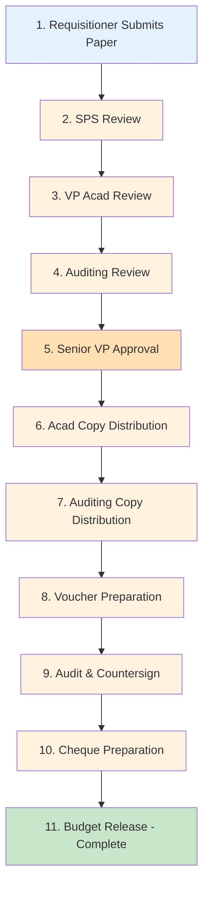
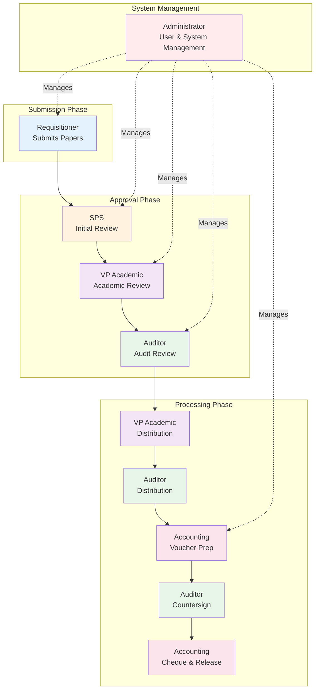
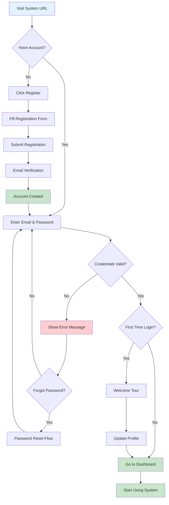
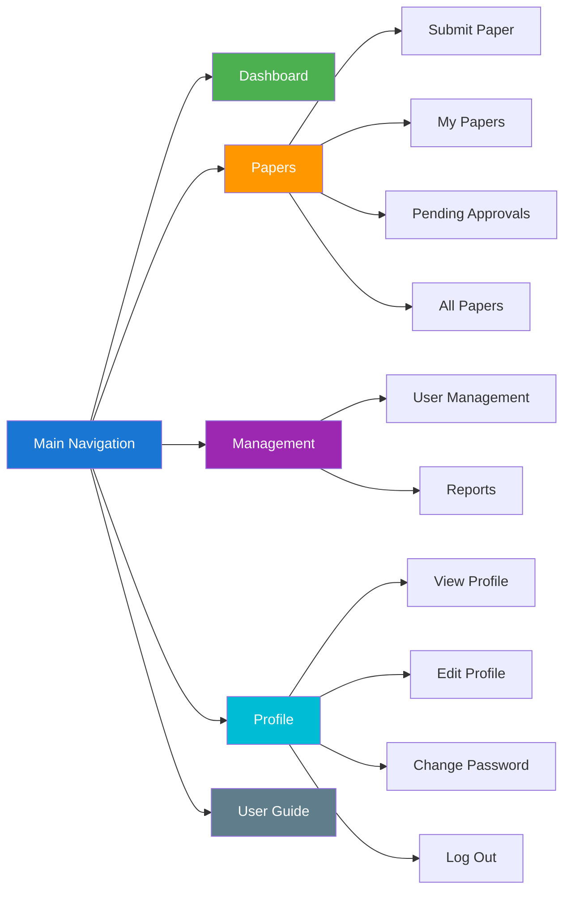
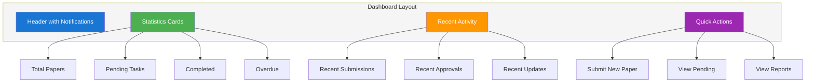
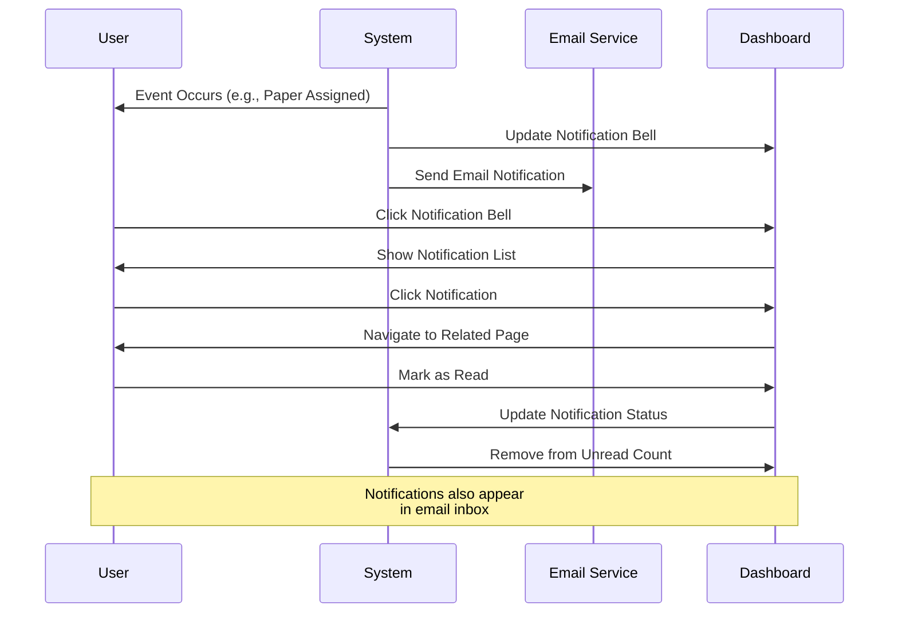
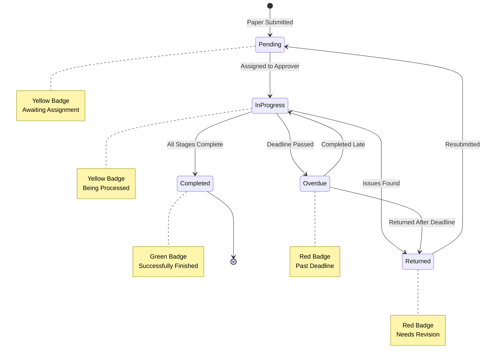

# Getting Started

## System Overview

The Concept Paper Tracker is a digital workflow management system designed to streamline the approval process for concept papers with budget allocation. The system replaces manual paper-based routing with an automated 10-step approval workflow.

### Key Benefits

-   **Transparency**: Track your submission status in real-time
-   **Efficiency**: Automated routing reduces processing time
-   **Accountability**: Complete audit trail of all actions
-   **Notifications**: Stay informed about pending tasks and deadlines

### Workflow Overview Diagram

The system follows a 10-step approval process:

### Who Uses This System?

The system serves seven distinct user roles:

1. **Requisitioners** - Submit and track concept papers
2. **SPS (School Principal/Supervisor)** - Initial review and approval
3. **VP Academic Affairs** - Academic review and distribution
4. **Senior VP** - Executive-level approval and oversight
5. **Auditor** - Audit review and countersigning
6. **Accounting** - Voucher and cheque preparation
7. **Administrator** - System management and reporting

#### User Roles and Responsibilities Diagram

## Logging In

### Accessing the System

1. Navigate to the login page
2. Enter your registered email address
3. Enter your password
4. Click "Log in"

#### Login Flow Diagram

### First Time Login

If this is your first time logging in:

-   You will be directed to your dashboard
-   Take a moment to familiarize yourself with the navigation
-   Check your profile to ensure your information is correct
-   Review the user guide sections relevant to your role

### Forgot Password

If you've forgotten your password:

1. Click "Forgot your password?" on the login page
2. Enter your email address
3. Check your email for a password reset link
4. Follow the instructions to create a new password
5. Return to the login page with your new password

### Account Issues

If you cannot log in:

-   Verify you're using the correct email address
-   Check that your account is active (contact your administrator)
-   Ensure your password is correct (use password reset if needed)
-   Contact technical support if problems persist

## Navigating the System

### Main Navigation

The main navigation menu provides access to key features based on your role:

#### Navigation Structure Diagram

**For Requisitioners:**

-   **Dashboard** - Your personalized overview with submission statistics
-   **Submit Paper** - Create new concept paper submissions
-   **My Papers** - View and track all your submissions
-   **Profile** - Manage your account information
-   **User Guide** - Access this documentation

**For Approvers (SPS, VP Acad, Auditor, Accounting):**

-   **Dashboard** - Overview of pending tasks and statistics
-   **Pending Approvals** - Papers awaiting your action
-   **All Papers** - View all papers in the system
-   **Profile** - Manage your account information
-   **User Guide** - Access this documentation

**For Administrators:**

-   **Dashboard** - System-wide overview and statistics
-   **All Papers** - Complete view of all submissions
-   **User Management** - Create and manage user accounts
-   **Reports** - Generate reports and export data
-   **Profile** - Manage your account information
-   **User Guide** - Access this documentation

### Dashboard Overview

Your dashboard provides a personalized view of the system:

#### Dashboard Layout Diagram

**Requisitioner Dashboard:**

-   Total papers submitted
-   Papers by status (Pending, In Progress, Completed, Returned)
-   Recent submissions
-   Quick access to submit new papers

**Approver Dashboard:**

-   Pending tasks requiring your action
-   Overdue items (highlighted in red)
-   Recently completed tasks
-   Quick access to pending approvals

**Administrator Dashboard:**

-   System-wide statistics
-   Total users by role
-   Papers by status
-   Recent activity
-   Quick access to management features

### Notifications

The notification bell icon in the top right corner keeps you informed:

**Notification Types:**

-   New paper assignments
-   Stage completions
-   Papers returned for revision
-   Overdue task reminders
-   System announcements

**Managing Notifications:**

1. Click the bell icon to view recent notifications
2. Click on a notification to view details
3. Mark individual notifications as read
4. Use "Mark all as read" to clear all notifications
5. Notifications are also sent via email

#### Notification Flow Diagram

### Profile Menu

Access your profile menu by clicking your name in the top right:

**Profile Options:**

-   **View Profile** - See your account information
-   **Edit Profile** - Update your name, email, department, school year, and student number
-   **Change Password** - Update your password for security
-   **Log Out** - Sign out of the system

### Search and Filters

Use search and filter features to find specific papers:

**Search by:**

-   Tracking number
-   Title
-   Requisitioner name
-   Department

**Filter by:**

-   Status (Pending, In Progress, Completed, Returned)
-   Current stage
-   Date range
-   Nature of request (Regular, Urgent, Emergency)

### Understanding Status Indicators

Papers display color-coded status badges:

-   **Yellow** - Pending or In Progress
-   **Green** - Completed successfully
-   **Red** - Overdue or Returned for revision
-   **Blue** - Information or system status

#### Status Flow Diagram

### Getting Help

If you need assistance:

1. **User Guide** - Check this documentation first
2. **FAQ Section** - Review frequently asked questions
3. **Contact Support** - Email support@example.com
4. **Administrator** - Contact your system administrator

## Next Steps

Based on your role, continue to the relevant guide section:

-   **Requisitioners** - Read the [Requisitioner Guide](#) to learn how to submit papers
-   **Approvers** - Read the [Approver Guide](#) to learn how to review and approve papers
-   **Administrators** - Read the [Administrator Guide](#) to learn about system management
-   **Everyone** - Review the [Workflow Process](#) to understand the complete approval flow

## Tips for Success

### For All Users

-   Check your dashboard daily for new tasks
-   Respond to notifications promptly
-   Keep your profile information up to date
-   Review the workflow process to understand your role

### For Requisitioners

-   Prepare all documents before starting submission
-   Provide complete and accurate information
-   Track your submissions regularly
-   Respond quickly to return requests

### For Approvers

-   Review pending tasks daily
-   Complete stages before deadlines
-   Provide clear, specific remarks when returning papers
-   Upload supporting documents when needed

### For Administrators

-   Monitor overdue stages regularly
-   Keep user accounts up to date
-   Generate reports for analysis
-   Ensure users are properly trained

## System Requirements

### Browser Compatibility

The system works best with modern browsers:

-   Google Chrome (recommended)
-   Mozilla Firefox
-   Microsoft Edge
-   Safari

### File Requirements

When uploading documents:

-   **Format**: PDF only
-   **Size**: Maximum 10MB per file
-   **Naming**: Use clear, descriptive filenames
-   **Content**: Ensure documents are readable and complete

### Internet Connection

-   Stable internet connection required
-   System saves progress automatically
-   Notifications sent in real-time

## Security Best Practices

### Password Security

-   Use a strong, unique password
-   Change your password regularly
-   Never share your password
-   Log out when finished

### Account Security

-   Verify your email address
-   Keep your profile information current
-   Report suspicious activity immediately
-   Use secure networks when accessing the system

### Data Privacy

-   Only access papers you're authorized to view
-   Don't share sensitive information
-   Follow your organization's data policies
-   Report security concerns to administrators
